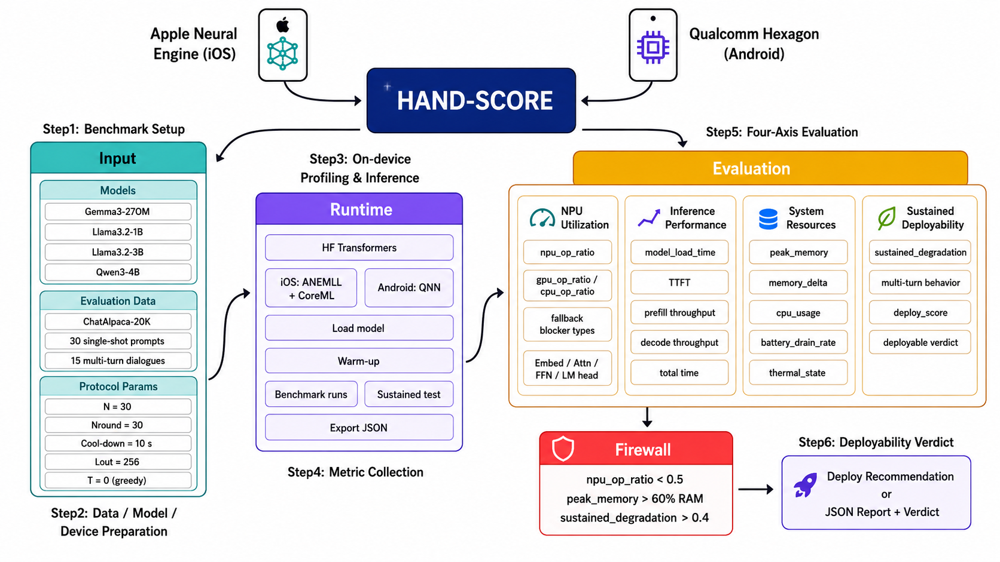

# HAND-Score
<p align="center">
  
</p>

Measurement code and dataset for the paper **HAND-Score: The Standard for Evaluating LLMs on Mobile NPUs**. This repository hosts the two on-device benchmark applications that produce the per-call JSON reports aggregated into the four-axis tables of the paper, together with the host-side analysis pipeline that turns those JSONs into the published `deploy_score` values.

| Path | Contents |
|---|---|
| `HAND-Score-iOS/` | iOS / Apple Neural Engine (ANE) measurement app, written in Swift (target: iPhone 15 Pro or later, iOS 17.4+) |
| `HAND-Score-Hexagon/` | Android / Qualcomm Hexagon NPU measurement app — **placeholder, to be filled in by the Hexagon app maintainer** |
| `scripts/` | Dataset preparation (`extract_samples.py`, `analyze_chatalpaca.py`) |
| `samples/` | Pre-built ChatAlpaca prompt set, summary JSONs, and the host-side aggregation script (`build_summary.py`) |

---

## What the paper measures (common to both apps)

For every model under test the apps run a six-phase HAND-Score protocol and write **one JSON file per LLM call** to local device storage. The host-side `samples/results/analysis/build_summary.py` script then folds those per-call JSONs into the four HAND-Score axes (**Sustainability**, **NPU utilization**, **Latency**, **Memory**) and computes the final `deploy_score`.

| Experiment | Identifier in JSON | Description |
|---|---|---|
| Exp A — Single-shot baseline | `mode: single_turn` | 30 ChatAlpaca prompts (15 Short / 10 Med-Short / 5 Medium) with a 10-second cool-down between calls |
| Exp C — Thermal stress | `mode: single_turn`, same prompt repeated 30+ times | The same sample is repeated for `N_round` rounds with **no cool-down**, used to compute `sustained_degradation` |
| Exp E — Multi-turn cumulative-context | `mode: multi_turn` | 15 ChatAlpaca dialogues (5 × 4-turn, 5 × 5-turn, 5 × 6-turn). At every assistant turn the entire chat history is re-prefilled from scratch (no KV-cache reuse) |
| Exp D — NPU profile | embedded in every JSON (`aneProfile` / `npuProfile`) | Op-level NPU / GPU / CPU mapping extracted from the underlying runtime API and classified into Embed / Attn+FFN / LM head |

Per-call metrics that every JSON must carry: `model_load_time`, `TTFT`, `prefill_throughput` (defined as `N_prompt / TTFT`, the standard convention used by Genie / llama.cpp / vLLM), `decode_throughput`, `total_time`, `peak_memory`, `cpu_usage`, `battery_drain_rate` (BDR), and the runtime-derived NPU profile.

---

## Shared dataset

Both apps consume the same prompt set, extracted from [robinsmits/ChatAlpaca-20K](https://huggingface.co/datasets/robinsmits/ChatAlpaca-20K):

- 30 single-turn prompts (15 Short ≤ 30 tokens, 10 Med-Short 30–80, 5 Medium 80–200)
- 15 multi-turn dialogues (5 of 4-turn, 5 of 5-turn, 5 of 6-turn)

Canonical file: `samples/chatalpaca_handscore.json`. The extraction script is `scripts/extract_samples.py`; the prompt set is deterministic and is committed verbatim to this repository so both apps produce comparable runs.

---

## Shared phase-0 protocol

Performed manually on the device before any measurement, identical for both platforms:

1. Charge the device above 80 %, then **disconnect external power**.
2. Wait at least 5 minutes after charge until the surface temperature returns to nominal.
3. Quit background apps; fix screen brightness; set auto-lock to "Never".

This protocol is what produces the *Battery Drain Rate* and *Sustained Degradation* numbers reported in the paper.

---

## Apple iOS — `HAND-Score-iOS/`

iOS / Apple Neural Engine measurement app. App display name on the Home Screen is **HAND-Score**.

| Item | Requirement |
|---|---|
| iOS device | iOS 17.4 or later (required for the `MLComputePlan` API used by Exp D) |
| iPhone | iPhone 15 Pro or later (Apple Neural Engine). A19 Pro and A18 Pro have been validated against the paper results |
| macOS for building | macOS 14 or later |
| Xcode | 16 or later |
| Swift | 6.0 |
| Apple Developer account | A free personal team is enough for sideloading; signing must succeed |

### Build and run

```bash
open HAND-Score-iOS/HAND-Score.xcodeproj
```

Set the signing team on the `HAND-Score` target, connect a supported iPhone, and press Run (⌘R). The first build resolves the SwiftPM dependencies (`HandScoreCore` and its transitive deps `swift-transformers`, `Stencil`, `Yams`); subsequent builds are incremental.

The app contains no bundled model. Models are obtained at runtime through the in-app HuggingFace downloader from the public `optai-inc/*-4096-ANE` namespace:

| Display name | HuggingFace repo |
|---|---|
| Gemma 3 270M | [`optai-inc/Gemma3-270m-4096-ANE`](https://huggingface.co/optai-inc/Gemma3-270m-4096-ANE) |
| Gemma 3 1B | [`optai-inc/Gemma3-1b-4096-ANE`](https://huggingface.co/optai-inc/Gemma3-1b-4096-ANE) |
| Llama 3.2 1B | [`optai-inc/Llama-3.2-1B-4096-ANE`](https://huggingface.co/optai-inc/Llama-3.2-1B-4096-ANE) |
| Llama 3.2 3B | [`optai-inc/Llama-3.2-3B-4096-ANE`](https://huggingface.co/optai-inc/Llama-3.2-3B-4096-ANE) |
| Qwen 3 4B | [`optai-inc/Qwen3-4B-4096-ANE`](https://huggingface.co/optai-inc/Qwen3-4B-4096-ANE) |

All five entries share the same conversion options: 4-bit FFN weights, 6-bit LM-head weights, fp16 activations, context length 4096, prefill batch size 64, and a 2-chunk decomposition for the 3B / 4B graphs.

### Retrieving results to the host machine

Each call writes one JSON to `Documents/HAND-Score/bench_<model>_<YYYYMMDD_HHMMSS>.json` inside the app container. To pull them off-device over USB or paired Wi-Fi:

```bash
xcrun devicectl device copy from \
  --device <device-uuid> \
  --domain-type appDataContainer \
  --domain-identifier com.optai.handscore \
  --source Documents \
  --destination /tmp/handscore_results
```

Full reproduction protocol, JSON schema, and notes on reproducibility live in **[`HAND-Score-iOS/README.md`](HAND-Score-iOS/README.md)**.

---

## Qualcomm Hexagon — `HAND-Score-Hexagon/`

> **Placeholder section.** The Android / Qualcomm Hexagon measurement application referenced in the paper's appendix is maintained separately and will be filled into this section by the Hexagon app maintainer. Until then, the items below mark what this section must answer to remain consistent with the iOS app.

### Requirements

> _TBD by Hexagon app maintainer_ — minimum Android version, supported SoC list (paper reports SM8750 and SM8850), required NDK / Android Studio versions, signing / install prerequisites.

### Build and run

> _TBD_ — gradle / SDK invocation, how to side-load to a supported Snapdragon device, and the analogue of "set the signing team / press Run".

### Model catalog

> _TBD_ — list of HuggingFace repos for the Hexagon-converted model artifacts that correspond one-to-one with the ANE catalog above, plus the conversion options (quantization scheme, context length, prefill batch size) used to match the iOS run.

### Per-call JSON schema

> _TBD_ — must produce the same top-level fields (`mode`, `config.prompt`, `performance.*`, `system.before/after/timeline`, `npuProfile`, `turnResults`) so `samples/results/analysis/build_summary.py` can ingest both platforms with a single code path. Field-by-field deviations from the iOS schema must be documented here.

### Retrieving results to the host machine

> _TBD_ — `adb pull` (or equivalent) command, target path on the device, and notes on USB / Wi-Fi parity with `xcrun devicectl`.

---

## Result aggregation (host side)

Both apps deposit one JSON per call. The host-side pipeline expects all of them to live under a single directory and produces the table values used in the paper:

```bash
cd samples/results/analysis
python3 build_summary.py
```

This regenerates the per-model summary JSONs and the LaTeX-ready `table_values.md`. The pre-computed summary JSONs (`Gemma3-270m_summary.json`, `Llama-3.2-1B_summary.json`, `Llama-3.2-3B_summary.json`, `Qwen3-4B_summary.json`, `qualcomm_summary.json`, `all_summary.json`) are committed in `samples/results/analysis/` so the paper's tables can be inspected without re-running any measurements.

The raw per-call JSONs (~44 MB for the iOS runs) are **not committed** to this repository; the analysis JSONs alone are enough to reproduce the published numbers. To regenerate them end-to-end, re-run the on-device measurement protocol described above.

---

## Result classification

Each per-call JSON belongs to one of the three experiments. The classification rule used by `build_summary.py` is purely textual:

| Mode in JSON | Heuristic | Experiment |
|---|---|---|
| `single_turn` | the `config.prompt` value is unique (or repeats < 20 times) within a session | Exp A |
| `single_turn` | the `config.prompt` value repeats 20+ times within a session | Exp C (thermal stress) |
| `multi_turn` | one JSON spans an entire dialogue, with one `turnResults[]` entry per user / assistant turn | Exp E |

---

## Repository layout

```
hand-score/
├── README.md                     # this file
├── LICENSE                       # MIT (covers the host-side scripts in this repo root)
├── HAND-Score-iOS/                     # iOS / ANE measurement app (Swift)
│   ├── README.md                 # iOS-specific build & reproduction guide
│   ├── LICENSE                   # MIT
│   ├── HAND-Score.xcodeproj        # Xcode project (display name "HAND-Score")
│   ├── Package.swift             # SwiftPM manifest
│   ├── HandScoreCore/            # vendored ANE inference runtime (originally AnemllCore, MIT)
│   │   ├── LICENSE-AnemllCore
│   │   └── Sources/HandScoreCore/
│   └── HAND-Score-iOS/                 # app source (App / Models / Services / ViewModels / Views / Datasets)
├── HAND-Score-Hexagon/             # Android / Hexagon measurement app — placeholder
│   └── README.md                 # what the Hexagon app maintainer must fill in
├── scripts/
│   ├── extract_samples.py        # builds chatalpaca_handscore.json from robinsmits/ChatAlpaca-20K
│   └── analyze_chatalpaca.py     # token-length analysis used to choose the 30 + 15 split
└── samples/
    ├── chatalpaca_handscore.json  # 30 single-turn + 15 multi-turn samples (committed)
    └── results/
        ├── README.md             # device-side retrieval and re-aggregation notes
        └── analysis/             # build_summary.py + pre-computed summary JSONs (committed)
                                  # raw/ is NOT committed (44 MB of per-call JSONs)
```

---

## Citation

If you use this code, the dataset, or the published numbers, please cite the paper:

```bibtex
@misc{handscore2026,
  title  = {HAND-Score: The Standard for Evaluating LLMs on Mobile NPUs},
  year   = {2026},
  note   = {Under review}
}
```

---

## License

The host-side scripts in this repository root and the iOS app under `HAND-Score-iOS/` are released under the MIT license. See [`LICENSE`](LICENSE) and [`HAND-Score-iOS/LICENSE`](HAND-Score-iOS/LICENSE).

Third-party components:

- `HAND-Score-iOS/HandScoreCore/Sources/HandScoreCore/*.swift` is derived from [AnemllCore](https://github.com/Anemll/Anemll) (MIT). See [`HAND-Score-iOS/HandScoreCore/LICENSE-AnemllCore`](HAND-Score-iOS/HandScoreCore/LICENSE-AnemllCore).
- `samples/chatalpaca_handscore.json` is extracted from [robinsmits/ChatAlpaca-20K](https://huggingface.co/datasets/robinsmits/ChatAlpaca-20K) and is redistributed under that dataset's license.
- Model weights downloaded at runtime through the in-app downloader are subject to the respective model licenses (Gemma Terms of Use, Llama Community License, Qwen license) and are NOT covered by the MIT license of this repository.
- License terms for the Qualcomm Hexagon app and its model artifacts are to be specified by the Hexagon app maintainer in `HAND-Score-Hexagon/`.
